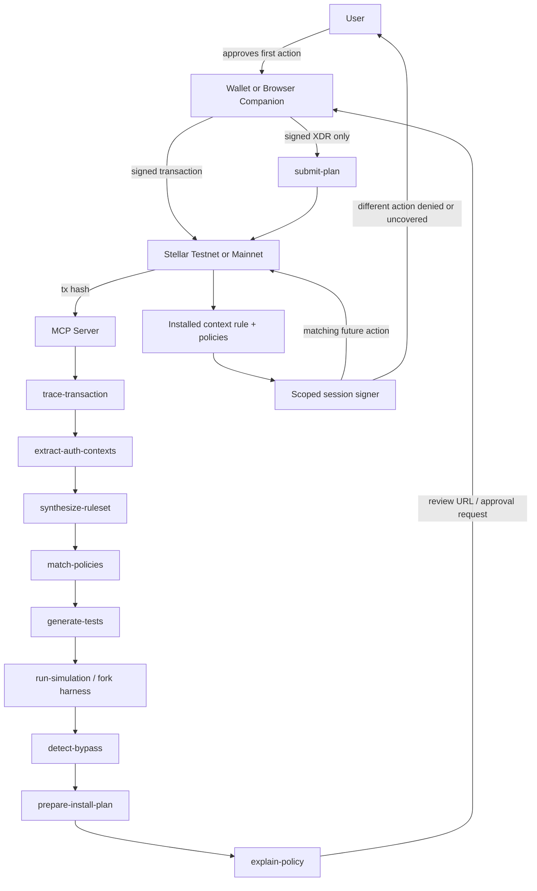
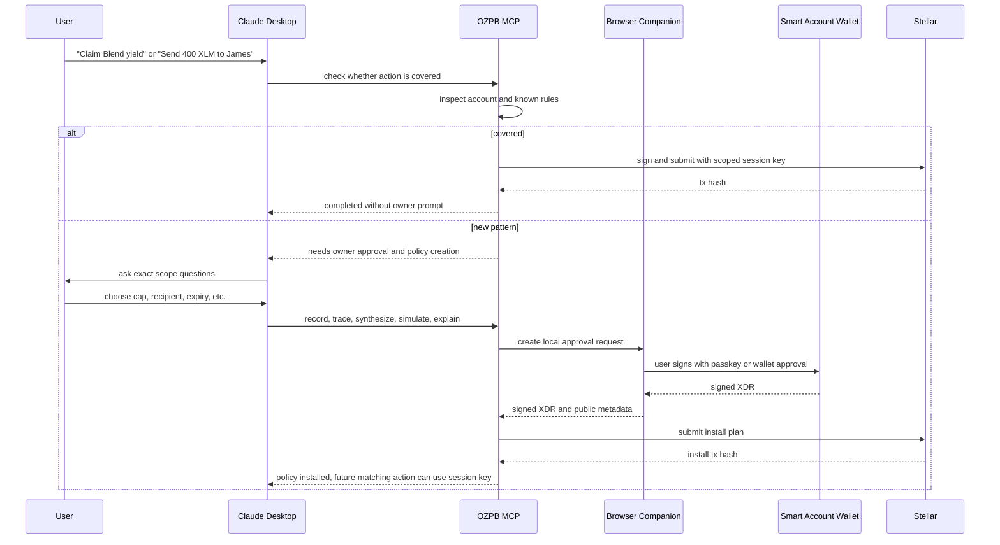

# OZ Policy Builder MCP

Deterministic policy engineering for OpenZeppelin Stellar smart accounts.

OZ Policy Builder is an AI-assisted developer and agent toolkit for turning observed Stellar activity into reviewable OpenZeppelin smart-account context rules and policies. The core workflow is:

```text
record a real or simulated transaction
-> extract the exact auth contexts
-> synthesize the smallest safe ruleset
-> generate or compose policies
-> prove permit and deny cases
-> prepare a reviewable install plan
-> install only after explicit user approval
-> let a scoped session key repeat matching actions
```

The project is built for the RFP use case: an AI agent should not hold a user's full wallet key. Instead, the user approves a first action, the toolkit learns that unique on-chain pattern, and future matching actions can be delegated through a narrow policy. Different actions fall back to human approval.

## Problem

AI agents are starting to operate on-chain, but the default wallet permission model is too broad.

If a user asks an agent to do something like:

- "Claim my Blend yield."
- "Send 400 XLM to James."
- "Pay this subscription every month."
- "Trade on Soroswap, but only within this slippage."

the unsafe version is giving the agent a full private key or repeatedly asking the user to approve every transaction. Both are bad:

- Full keys give the agent too much power.
- Repeated approval destroys automation.
- Manually writing OpenZeppelin smart-account policies is too hard for most app developers and impossible for normal users.
- A policy mistake can either block the intended action or silently allow more than intended.

OpenZeppelin's Stellar smart accounts already provide the right primitives: context rules, signers, and policies. The hard part is authoring them correctly from real user intent.

## Solution

OZ Policy Builder records a transaction the user already approved, reads what actually happened on-chain, and turns that observed behavior into a narrow smart-account grant.

The AI agent can propose the policy, but deterministic tools do the security-critical work:

- decode the transaction;
- extract contract/function/argument contexts;
- synthesize minimal context rules;
- select existing OZ policies where possible;
- generate custom policy code only when needed;
- run allow and deny simulations;
- detect bypasses from existing rules;
- build an install plan;
- require explicit approval before any write.

The MCP server is the agent-facing brain. The browser wallet companion is the signing surface. The smart account is the on-chain enforcement layer.

## User Persona Example

Nina runs treasury operations for a small DeFi team. She wants a Claude Desktop agent to claim rewards and rebalance small amounts, but she does not want the agent to have full wallet control.

1. Nina performs the first action herself: supply XLM collateral to the Blend testnet pool.
2. Her wallet asks for approval. She approves.
3. OZ Policy Builder captures the transaction hash.
4. The MCP tools trace the transaction and detect two auth contexts:
   - Blend pool `submit`
   - nested XLM token `transfer`
5. Claude asks a clarification: "Should this be exactly 100000 stroops, up to 100000, or a daily cap?"
6. Nina chooses a cap and expiry.
7. The toolkit generates a ruleset, policies, deny cases, and an install plan.
8. Nina reviews and signs the install.
9. Tomorrow the same matching action runs with a session key.
10. If the agent changes the amount, token, contract, or function, the session key cannot cover it and the flow routes back to Nina.

## Architecture



## Core Components

| Component | Path | Purpose |
|---|---|---|
| Core schemas and synthesis | `packages/core` | Canonical hashes, policy intent, candidate rulesets, policy synthesis, test generation |
| Stellar integration | `packages/stellar` | RPC wrapper, XDR decoding, ScVal bridge, auth digest, account inspection, transaction tracing |
| Planning and verification | `packages/plans` | Simulation engines, install/revocation plans, explainers, submit gates |
| MCP server | `packages/mcp-server` | Agent-facing tool registration, stdio transport, structured tool boundary |
| Wallet bridge | `packages/wallet-bridge` | Local approval server, browser companion, wallet approval request flow |
| Rust policy library | `rust/` | Policy-builder contracts: function allowlist, arg guard, call cap, rate limit |
| Rust fork harness | `rust/harness` | Native harness for permit/deny simulation against policy cases |
| Testnet fixtures | `fixtures/testnet` | Real reproducible evidence from deployed contracts and testnet transactions |
| Scripts | `scripts/` | Testnet deploys, SD4 demos, wallet demo, checks, coverage, sandbox smoke |
| Architecture docs | `docs/architecture` | Full design volumes and edge-case catalog |

## Feature Set

### Built

- Deterministic canonical hashing for intents, evidence, rulesets, plans, and reports.
- Zod schemas for the major pipeline artifacts.
- Stellar RPC integration with budgeted calls and test coverage.
- XDR transaction decoding and auth-entry extraction.
- ScVal decoding/encoding helpers for policy and install parameter work.
- OZ smart-account inspection by ledger storage and WASM hash classification.
- Real testnet fixture deployment for OZ smart account, verifier, and policies.
- `trace-transaction` on real testnet transactions.
- `extract-auth-contexts` for root and sub-invocation auth contexts.
- Intent-guided and evidence-guided ruleset synthesis.
- Policy matching against OZ primitives and project `pb:*` policies.
- Policy-builder Rust crates:
  - `pb_function_allowlist`
  - `pb_arg_guard`
  - `pb_call_cap`
  - `pb_rate_limit`
- Rust policy tests and WASM builds.
- Testnet deployment records for the `pb:*` policy contracts.
- Code generation path with fenced templates and manifest.
- Permit and deny test generation.
- Native sandbox and Rust harness execution path.
- Bypass detection for broad existing rules and known policy classes.
- Install and revocation plan builders.
- Human-readable policy explanation.
- Submit gate that accepts signed XDR rather than secrets.
- MCP server skeleton with registered tool wrappers.
- Wallet bridge and browser companion with local bundled JavaScript.
- Session-key demo proving matching actions can route through a scoped signer and changed actions route back to owner approval.
- Real Blend testnet submit fixture using the official Blend testnet registry and `@blend-capital/blend-sdk`.
- Multi-context auth digest proof for Blend:
  - one auth entry;
  - two contexts;
  - `context_rule_ids: [0, 0]`;
  - accepted by a real OZ smart account on testnet.

### Planned / Remaining

- Clean final demo account without a broad admin-equivalent default rule masking the policy.
- One polished script for the full flow:
  - record;
  - synthesize;
  - simulate;
  - install;
  - repeat with session key;
  - changed action routes to human approval.
- Production-grade browser passkey approval using `smart-account-kit`.
- MCP UX polish:
  - high-level orchestration tools;
  - cleaner schemas;
  - stable user-facing error docs;
  - skill prompts.
- Real fork harness as the default `run-simulation` engine in the final MCP path.
- Three end-to-end walkthrough documents:
  - Blend yield or supply flow;
  - SEP-41 subscription billing;
  - Soroswap bounded delegation.
- Security review and audit package.
- CI release hardening:
  - Rust coverage gate;
  - protocol canaries;
  - non-network smoke tests;
  - optional/manual testnet jobs.
- Final Claude skill package and demo instructions.

## Real Testnet Evidence

The repository contains real testnet fixtures under `fixtures/testnet`.

Recent SD4 Blend proof:

- Fixture: `fixtures/testnet/sd4-real-blend-submit-tx.json`
- Network: Stellar testnet
- Blend registry: `https://raw.githubusercontent.com/blend-capital/blend-utils/main/testnet.contracts.json`
- Blend pool: `CCEBVDYM32YNYCVNRXQKDFFPISJJCV557CDZEIRBEE4NCV4KHPQ44HGF`
- XLM reserve token: `CDLZFC3SYJYDZT7K67VZ75HPJVIEUVNIXF47ZG2FB2RMQQVU2HHGCYSC`
- Real Blend submit tx: `a8993839b88cec84870112ee4fbe6b98c0050ed70fa16b8ebae1750d07dfab23`
- Extracted contexts:
  - `submit` on the Blend pool;
  - nested `transfer` on the XLM token.
- Synthesized rules: 2
- Unsatisfied constraints: 0

Important finding: the first attempt signed only `[0]` as the context-rule selector and failed on-chain. The successful real transaction signed `[0, 0]`, matching the two-context authorization tree. This validates the multi-context digest alignment requirement.

## Test Matrix

### Local TypeScript

```bash
corepack pnpm run check
```

Runs:

- TypeScript build;
- wallet companion bundle build;
- Vitest;
- ESLint;
- secret scan;
- cross-reference checks.

Current result: 177 TypeScript tests passing.

### Rust Policy Library

```bash
corepack pnpm run rust:test
corepack pnpm run rust:clippy
corepack pnpm run rust:build
```

Covers the policy-builder crates and WASM build path.

### Rust Harness

```bash
corepack pnpm run rust:harness:clippy
```

Checks the native simulation harness.

### Blend Fork / Sandbox Harness

```bash
corepack pnpm run sd4:compose-blend-fork
```

Current cases:

| Case | Expected |
|---|---|
| `blend-submit-400-reserve` | pass |
| `blend-submit-401-reserve-denied` | deny with policy error |
| `blend-submit-wrong-token-denied` | deny with policy error |
| `blend-withdraw-wrong-function-denied` | deny with policy error |

### Real Testnet Blend Flow

```bash
corepack pnpm run sd4:real-blend-testnet
```

This sends real testnet transactions. It requires the local Stellar CLI key aliases and fixture secrets configured for the test account. It writes `fixtures/testnet/sd4-real-blend-submit-tx.json`.

### Real Auth Digest Replay

```bash
corepack pnpm run sd4:auth-digest-replay
```

Proves the auth digest path against a real deployed OZ smart account.

### Session-Key Demo

```bash
corepack pnpm run sd4:session-key-testnet
```

Installs a scoped session-key rule on testnet, submits a matching action with the session signer, and records that a changed action routes back to owner approval.

## Demo Flow Target

The intended final demo for Claude Desktop is:



## Security Model

The project deliberately separates decision-making from signing.

- The MCP can read, decode, synthesize, simulate, explain, and build unsigned plans.
- The MCP must not receive owner secrets.
- The browser or wallet signs owner-approved actions.
- `submit-plan` accepts signed XDR and verifies gates before submission.
- Session keys are scoped by installed context rules and policies.
- Unknown policy classes fail closed as `UNKNOWN`, not safe.
- Bypass detection reports broad old rules that could already allow the action.
- Generated code is reviewable before deployment.
- Deployment is never automatic in the core workflow.

Known current demo caveat: the active test fixture still has a broad default admin-equivalent rule. This is useful for early testnet automation, but the final submission demo should use a cleaner account so bypass detection is green and the new policy is the only route.

## Roadmap

| Phase | Theme | Status |
|---|---|---|
| 0 | Repo, schemas, hashing, CI foundation | Mostly built |
| 1 | Stellar decode, ScVal, auth digest | Built and real-testnet proven |
| 2 | Fixtures and inspection tools | Built with real testnet fixtures |
| 3 | Intent and ruleset synthesis | Built |
| 4 | Verify and install planning | Built, needs fork engine as default final path |
| 5 | History, evidence, bypass detection | Built for current fixture path; more corpus needed |
| 6 | Rust `pb:*` policy library | Built, deployed to testnet, needs final coverage gate polish |
| 7 | Codegen and example-driven synthesis | Built at library level; needs final walkthrough proof |
| 8 | Wallet integration, skill, walkthroughs | Partially built; main remaining product work |
| 9 | Production hardening, audit, release | Remaining |

## Next Milestones

1. Create a clean final demo smart account without a broad default bypass.
2. Wire one command that performs the full record-to-session-key lifecycle.
3. Finish the production passkey/browser approval path with `smart-account-kit`.
4. Promote the fork harness into the default MCP `run-simulation` path.
5. Write the three walkthroughs and final security/audit notes.
6. Cut a release package for MCP plus Claude skill.

## Development

Install dependencies:

```bash
corepack pnpm install
```

Run the main local quality gate:

```bash
corepack pnpm run check
```

Run infrastructure checks:

```bash
corepack pnpm run infra:check
```

Start the MCP stdio server for Claude Desktop after building:

```bash
corepack pnpm run build
corepack pnpm run mcp:stdio
```

## License

Apache-2.0.
